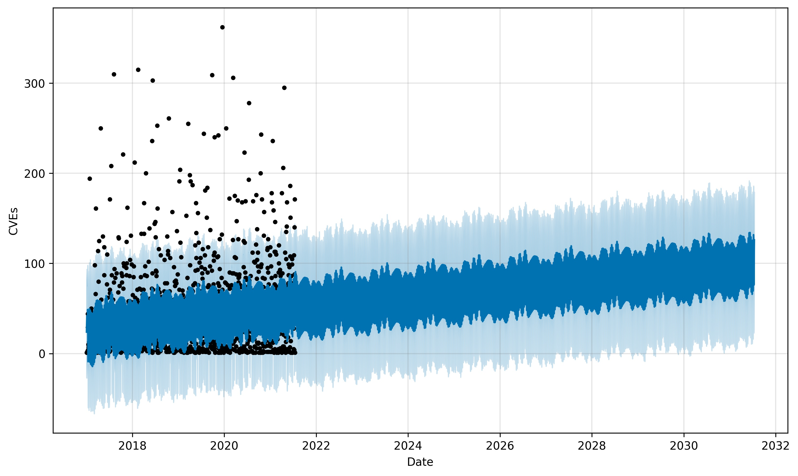

# CVE Prophet 2017

_This has the same code as the root repo but starts with the 2017 dataset on the suggestion of [@BrianPKime](https://twitter.com/BrianPKime)._

I was recently asked if I had ever thought about trying to predict CVE growth.  I had not, or really didn't even know where to start, but after some research, I found the [Prophet project](https://facebook.github.io/prophet/) that is a forecasting algorithm [open-sourced by Facebook](https://research.fb.com/prophet-forecasting-at-scale/) and uses the [GAM family of algorithms](https://en.wikipedia.org/wiki/Generalized_additive_model).

Using prophet with the [NVD data](https://nvd.nist.gov/vuln/data-feeds#JSON_FEED) in a Jupyter notebook was a lot easier than I expected, and for the first iteration, I am thrilled with the outcome.

## Graphs

## Contributing

Contributions are what make the open source community such an amazing place to be learn, inspire, and create. Any contributions you make are **greatly appreciated**.

1. Fork the Project
2. Create your Feature Branch (`git checkout -b feature/AmazingFeature`)
3. Commit your Changes (`git commit -m 'Add some AmazingFeature'`)
4. Push to the Branch (`git push origin feature/AmazingFeature`)
5. Open a Pull Request

## Support

Use the [issues](https://github.com/jgamblin/cveprophet) tab to report any problems or issues.

## License

Distributed under the MIT License. See `LICENSE` for more information.

## Contact

Jerry Gamblin - [@jgamblin](https://twitter.com/jgamblin)
